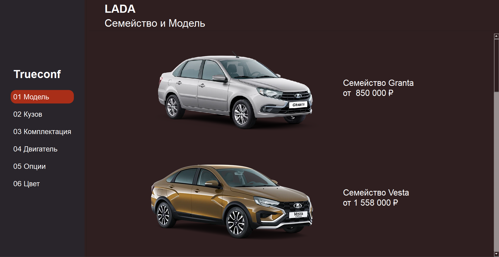
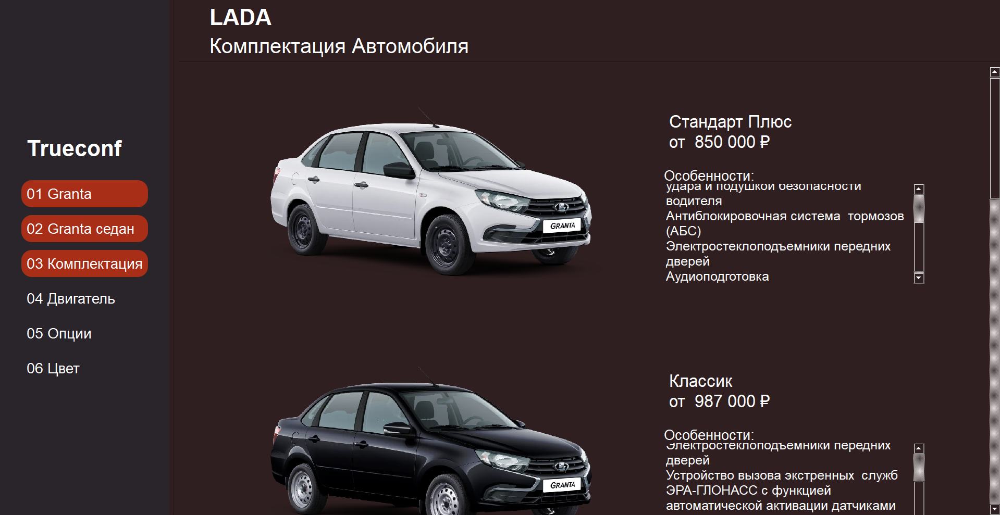
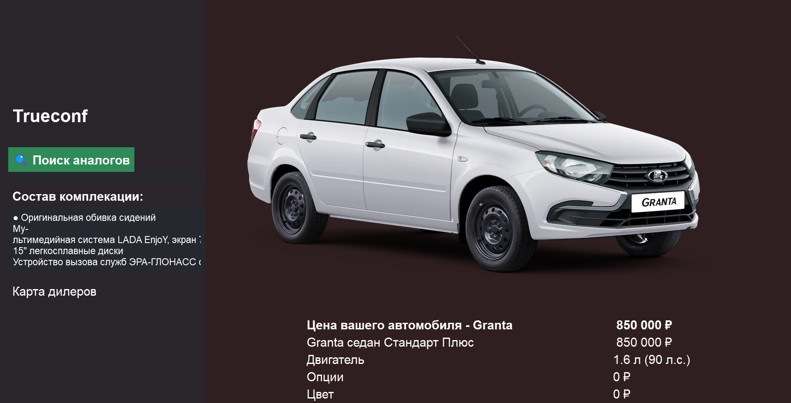

# LADA Car Configurator


Desktop application for configuring LADA vehicles with real-time price calculation, dealer map integration, and secondary market analog search.

## ✨ Features

### **Interactive Car Configuration**
- **Multi-step Selection Process**: Brand → Model → Body → Complectation → Engine → Options → Color
- **Real-time Price Calculation**: Automatic total price updates with formatted display (1 000 000 ₽)
- **Visual Preview**: High-quality images for each configuration option with scaling optimization

### **Database Management**
- **Automatic Data Updates**: Parses official LADA API to fetch current models, prices, and specifications
- **SQLite Storage**: 5 normalized tables (MODEL, BODY, COMPLECTATION, EQUIPMENT, COLOR)
- **Unicode Normalization**: Proper handling of Cyrillic characters in file paths and database entries

### **Additional Services**
- **Dealer Map**: Yandex Maps integration with city-based dealer search
- **Analog Search**: Opens Auto.ru with pre-configured filters (price range ±30%, body type, engine displacement)
- **Export Configuration**: Save final configuration to .txt file

## 📦 Installation

### **Clone the repository**
```bash
git clone https://github.com/yourusername/TrueConf.git
cd TrueConf
```

### **Set up virtual environment**
Windows/Linux/Mac
```bash
python -m venv venv
```

```bash
venv\Scripts\activate  # Windows
```

```bash
source venv/bin/activate  # Linux/Mac
```
Anaconda
```Anaconda
conda create --name Lada 
source activate Lada
```

### **Install dependencies**
```bash
pip install -r requirements.txt
```

### **Initialize database**
```bash
python DBUPDATE.py
```
This downloads current LADA data (~50-100 MB of images) and creates `lada.db`.

## 🚀 Usage

### **Run the application**
```bash
python Trueconf.py
```

### **Configuration Workflow**

1. **Select Brand**: Choose LADA from the main menu

2. **Select Model**: Granta, Vesta, Largus, Niva, XRAY, Aura, Priora

3. **Select Body**: Sedan, Hatchback, Universal, SUV, etc.
4. **Select Complectation**: Standard, Standard Plus, Classic, Comfort, Luxe

5. **Select Engine**: View available engine options with prices
6. **Select Options**: Add optional equipment (checkboxes with visual confirmation ✅)
7. **Select Color**: Choose from available colors with price differences

8. **Review**: View total price with breakdown by category

### **Additional Features**

| Feature | Access | Description |
|---------|--------|-------------|
| **Dealer Map** | Button "Карта дилеров" | Search LADA dealers by city on Yandex Maps |
| **Analog Search** | Button "🔍 Поиск аналогов" | Opens Auto.ru with pre-filtered search (±30% price, same body/engine) |
| **Save Configuration** | Button "Сохранить" | Export configuration to .txt file |
| **Database Update** | Settings → Update | Refresh data from LADA API (30 min cooldown) |

### **Keyboard Shortcuts**
- `Enter` in city search → Find dealers
- `Esc` → Return to previous window (where applicable)

## 🛠️ Core Modules


| Module | Classes |
|--------|---------|
| `Trueconf.py` | `Main_window` (entry point), `Model/Body/Complectation/Engine/Options/Color` (config steps), `In_total` (summary), `Dealers_map` (Yandex Maps), `AnalogSearch` (Auto.ru search), `Settings/Load` (DB update) |
| `DBUPDATE.py` | `Parsing` (base parser), `ParsingLada` (LADA API parser), `UpdateDB` (SQLite creator) |


## 📁 Project Structure

```
lada-configurator/
├── Trueconf.py              # Main application
├── DBUPDATE.py              # Database parser and updater
├── lada.db                  # SQLite database (generated)
├── lada/                    # Images directory (generated)
│   └── pictures/
│       ├── models/
│       ├── bodies/
│       ├── complectations/
│       ├── engines/
│       ├── options/
│       └── colors/
├── ui/                      # Qt Designer .ui files
│   ├── mainmm.ui
│   ├── window.ui
│   ├── fwindow.ui
│   ├── settings.ui
│   └── load.ui
├── setup.py                 # cx_Freeze build configuration
├── requirements.txt         # Python dependencies
└── README.md               # This file
```

## 🔧 Compilation

### **Build standalone .exe (Windows)**
```bash
python setup.py build
```

### **Run compiled application**
```bash
build\exe.win-amd64-3.11\Trueconf.exe
```

## ⚙️ Configuration

### **Database Update Settings**
| Parameter | Default | Description |
|-----------|---------|-------------|
| `proxy` | `False` | HTTP/HTTPS proxy for API requests |
| `use_headers` | `True` | Include User-Agent and Referer headers |
| `timeout` | `10-20s` | Request timeout per API call |
| `retry` | `3` | Retry attempts on failure |
| `cooldown` | `30 min` | Minimum time between updates |


## 🧩 Troubleshooting

| Issue | Solution |
|-------|----------|
| **Database not found** | Run `python DBUPDATE.py` to initialize |
| **API request fails** | Enable proxy in Settings, check internet connection |
| **Map not loading** | Verify Yandex Maps API key, check internet connection |
| **Auto.ru blocked** | Click "Открыть в браузере" to open in system browser |
| **Update cooldown** | Wait 30 minutes or delete `timeup` variable in DB |

## 🤝 Contributing

This is a production application for LADA dealers and customers. Suggestions and improvements are welcome.

### **Code Standards**
- Python 3.10+
- PEP 8 style guide
- Cyrillic comments allowed (UTF-8 encoding)
- PyQt5 signal/slot architecture

## 📞 Support

- **Telegram**: [@Lil_soupchik](https://t.me/Lil_soupchik)
- **Issues**: GitHub Issues tab
- **Documentation**: Inline code comments (Russian)

## 📄 License

This project is open-source and available under the [MIT License](LICENSE).
